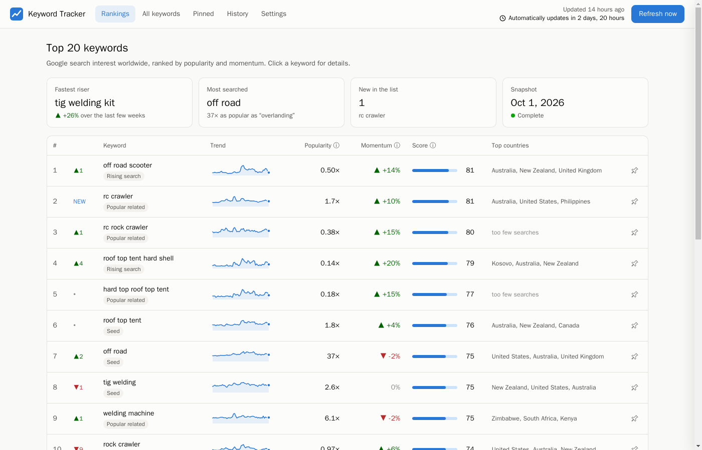
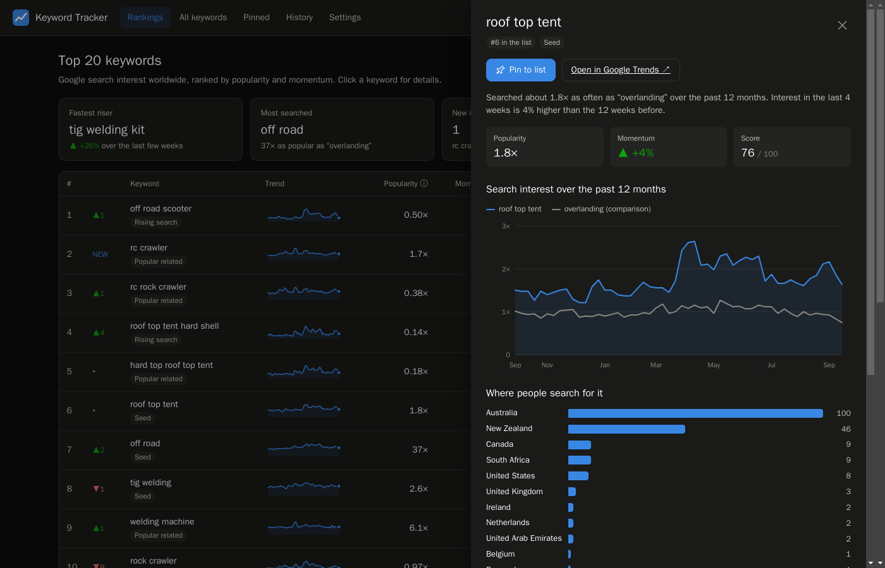
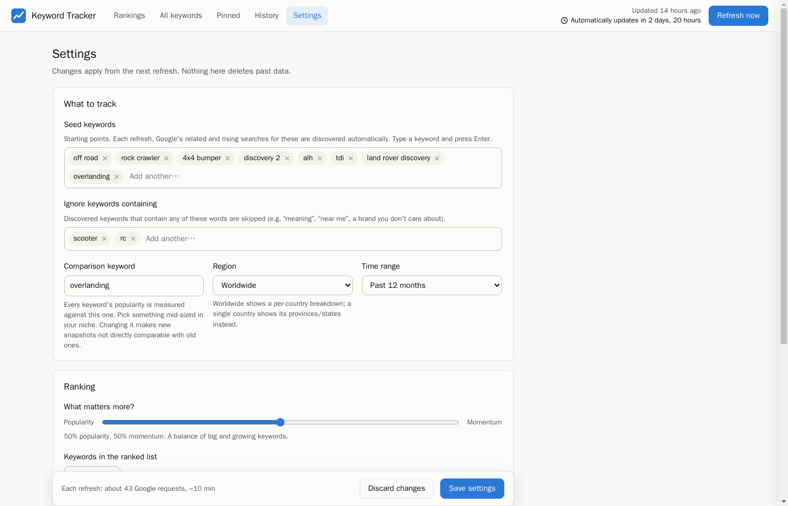

# Keyword Tracker

A self-hosted Google Trends tracker for a niche. Give it a few seed keywords and it finds related and rising searches on its own. It ranks them by popularity and momentum and refreshes every week. Everything runs in one Docker container with a web UI.



| Keyword detail (dark mode) | Settings |
|---|---|
|  |  |

## Features

- **Auto-discovery**: each refresh pulls Google's rising and popular related searches for your seeds, so new keywords show up without you adding them.
- **Ranked top list**: a blend of popularity and momentum (last 4 weeks vs. the 12 before). A slider in Settings sets the balance.
- **Similar keywords grouped**: variants like "1.9 alh" and "1.9 alh tdi" fold into one row under "alh", so the list shows more different things. Specific things like "alh turbo" keep their own row.
- **Deep dive**: for each seed, collects what people actually type into Google ("alh injector seals", "alh intake manifold gasket") and groups it by topic. These phrases are too specific for Trends to measure, so this is where the detail shows up.
- **Multiple markets**: track up to 5 at once (Worldwide, Canada, the US, …), each with its own rankings and deep dive. Switch between them from the top bar.
- **Pins**: keywords you pin always appear in the list, with an optional note.
- **Ignore words**: hide off-topic keywords (e.g. "rc", "near me"). They disappear from the lists as soon as you save, the next-best keywords move up, and future refreshes skip them.
- **Country breakdown** for the ranked keywords. The rest of the pool is skipped to save requests.
- **History**: every weekly snapshot is kept, and you can open any past one.
- **Weekly schedule** with catch-up: if the machine was off at refresh time, it runs when the machine comes back. A refresh cut off by a restart or power loss starts over automatically.
- **Explained as you go**: hover over (or tap) any ⓘ icon for a plain-English explanation.
- **Light/dark mode** that follows your system, and works on phones.
- **SQLite storage**: one file you can back up, query or export.

## Download (Windows and Mac)

The easiest way to try it: download the app, double-click it, and it opens in your web browser. No Docker or Python needed.

**[Download the latest version](https://github.com/outlandfabworks/keyword-tracker/releases/latest)**, then follow the steps on that page. They cover the one-time "Windows protected your PC" / macOS security prompt, which appears because the app isn't commercially signed.

The desktop app runs only while it's open. If it was closed at update time, it catches up next time you open it. To have it always running (for example on a home server), use Docker instead:

## Install with Docker

You need Docker with the Compose plugin.

```sh
git clone https://github.com/outlandfabworks/keyword-tracker.git
cd keyword-tracker
cp .env.example .env        # set your time zone; optionally a password
docker compose up -d
```

Open **http://localhost:8090**, or `http://<server-ip>:8090` from another device. The first refresh starts automatically within a minute of the first launch and takes around 10 minutes. Meanwhile, set your seed keywords under **Settings**.

### Pre-built image

To skip building, replace `build: .` in `docker-compose.yml` with:

```yaml
    image: ghcr.io/outlandfabworks/keyword-tracker:latest
```

Images are published for `amd64` and `arm64` (e.g. Raspberry Pi 4/5).

### Adding it to an existing compose stack

```yaml
  keyword-tracker:
    image: ghcr.io/outlandfabworks/keyword-tracker:latest
    restart: unless-stopped
    ports:
      - "8090:8090"
    environment:
      TZ: "America/New_York"
      KWT_PASSWORD: ""          # optional login
    volumes:
      - ./data/keyword-tracker:/data
```

## Configuration

Most settings are in the web UI: seeds, ignored words, comparison keyword, markets, time range, ranking balance, list size, grouping, deep dive and schedule. They're stored in the database. `config.toml` only supplies defaults for the first start.

Environment variables (in `.env`):

| Variable | Default | Purpose |
|---|---|---|
| `TZ` | `UTC` | Time zone for the weekly schedule |
| `KWT_PORT` | `8090` | Port for the web UI |
| `KWT_PASSWORD` | *(empty)* | If set, the UI asks for a login (any username, this password) |

## How the numbers work

Google Trends doesn't publish search counts. It gives a 0–100 scale relative to the other terms in the same request, with at most 5 terms per request. To compare dozens of keywords:

1. Every request includes a **comparison keyword** ("overlanding" by default) plus 4 others, and every value is divided by the comparison keyword's average. **Popularity 2×** means searched twice as often as the comparison keyword.
2. Google scales each request so its biggest term peaks at 100. That means a small keyword batched with a huge one comes back as rounding noise. Those keywords are fetched a second time alongside similar-sized ones.
3. **Momentum** compares average interest in the last 4 weeks to the 12 weeks before.
4. **Score** ranks every keyword on both measures and blends the two ranks. Pinned keywords always make the list.
5. **Deep dive** results come from Google autocomplete: each seed is typed in followed by every letter ("alh a", "alh b", …) and the suggestions are grouped by the first word that names a thing. There are no search counts for these; Google lists the most common first.
6. **Countries** are Google's per-country share of searches, where 100 is the country where the keyword is most popular relative to its size. Countries and territories under about 1 million people are hidden by default, because a handful of searches can put them on top.

## Good to know

- **It uses unofficial APIs.** Trends data comes from [pytrends](https://github.com/GeneralMills/pytrends), which scrapes Google Trends and is no longer maintained, and deep-dive searches come from Google's autocomplete endpoint. Google can change either and break it at any time. All Google-facing code is in `tracker/trends.py` and `tracker/suggest.py`.
- **Rate limits.** Google throttles aggressive clients, so refreshes pause 8–15 seconds between requests and back off on errors. A refresh takes around 15–20 minutes per market with deep dive on. If the History tab shows frequent "Partial" refreshes, raise the delays under Settings → Advanced.
- **Security.** There's no login unless you set `KWT_PASSWORD`. Run it on your home network or behind a VPN or reverse proxy; don't expose it directly to the internet.
- Not affiliated with Google.

## Backup, update, remove

```sh
cp -r data/ backup/                              # all history, pins and settings live in data/keywords.db
git pull && docker compose up -d --build         # update (or `docker compose pull && docker compose up -d` with the pre-built image)
docker compose down && rm -rf data/              # remove
```

## Command line (optional)

```sh
docker compose exec keyword-tracker python -m tracker top
docker compose exec keyword-tracker python -m tracker pin "tube bender" --note "core product"
docker compose exec keyword-tracker python -m tracker pins
```

## Development

```sh
docker build -t keyword-tracker:test .
docker run --rm -v "$PWD/tests:/app/tests:ro" keyword-tracker:test python -m unittest -v
```

The code is in `tracker/`:

| File | What it does |
|---|---|
| `trends.py`, `suggest.py` | Google access (Trends, autocomplete) |
| `pipeline.py` | One refresh, start to finish |
| `ranking.py`, `ideas.py` | Pure scoring, grouping and part-idea functions |
| `web.py` | API and scheduler |
| `desktop.py` | Launcher for the Windows/Mac apps (built by `packaging/keyword-tracker.spec`) |
| `static/` | The UI, plain JS with no build step |

The tests don't call Google; they use a fake client that mimics its scaling.

## License

[MIT](LICENSE)
